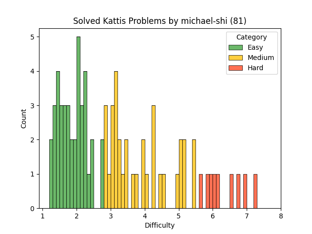

# mfshi03 Kattis Problems

Problems I have solved on [Kattis](https://open.kattis.com) for VT-ICPC.

Make sure to check this only if you have no furthur ideas.

> [!TIP]
>
> "The ideal problem is the problem you can barely solve given an infinite amount of time"
>
> - Walden Yan (IOI Gold Medalist)
### Problem Difficulty

<table>
<thead>
<td>Name</td>
<td>Difficulty</td>
<td>Link</td>
</thead>
<tbody>

<tr>
<td>10 Kinds of People</td>
<td>3.9</td>
<td>https://open.kattis.com/problems/10kindsofpeople</td>
</tr>

<tr>
<td>3D Printed Statues</td>
<td>2.9</td>
<td>https://open.kattis.com/problems/3dprinter</td>
</tr>

<tr>
<td>Abandoned Animal</td>
<td>5.4</td>
<td>https://open.kattis.com/problems/abandonedanimal</td>
</tr>

<tr>
<td>Abstract Art</td>
<td>6.7</td>
<td>https://open.kattis.com/problems/abstractart</td>
</tr>

<tr>
<td>The Calculus of Ada</td>
<td>2.4</td>
<td>https://open.kattis.com/problems/ada</td>
</tr>

<tr>
<td>Alphabet Animals</td>
<td>4.2</td>
<td>https://open.kattis.com/problems/alphabetanimals</td>
</tr>

<tr>
<td>Falling Apples</td>
<td>3.2</td>
<td>https://open.kattis.com/problems/apples</td>
</tr>

<tr>
<td>Paradox With Averages (Hard)</td>
<td>3.0</td>
<td>https://open.kattis.com/problems/averageshard</td>
</tr>

<tr>
<td>Beast Bullies</td>
<td>6.1</td>
<td>https://open.kattis.com/problems/beastbullies</td>
</tr>

<tr>
<td>Letter Optimization</td>
<td>5.0</td>
<td>https://open.kattis.com/problems/brevoptimering</td>
</tr>

<tr>
<td>Bus</td>
<td>1.8</td>
<td>https://open.kattis.com/problems/bus</td>
</tr>

<tr>
<td>Cheating a Boolean Tree</td>
<td>4.2</td>
<td>https://open.kattis.com/problems/cheatingbooleantree</td>
</tr>

<tr>
<td>Chess</td>
<td>3.1</td>
<td>https://open.kattis.com/problems/chess</td>
</tr>

<tr>
<td>Chocolate Chip Fabrication</td>
<td>5.8</td>
<td>https://open.kattis.com/problems/chocolatechipfabrication</td>
</tr>

<tr>
<td>Circuit Math</td>
<td>2.2</td>
<td>https://open.kattis.com/problems/circuitmath</td>
</tr>

<tr>
<td>Class Field Trip</td>
<td>1.4</td>
<td>https://open.kattis.com/problems/classfieldtrip</td>
</tr>

<tr>
<td>Code Guessing</td>
<td>3.1</td>
<td>https://open.kattis.com/problems/codeguessing</td>
</tr>

<tr>
<td>Common Factors</td>
<td>5.0</td>
<td>https://open.kattis.com/problems/commonfactors</td>
</tr>

<tr>
<td>Competitive Arcade Basketball</td>
<td>2.4</td>
<td>https://open.kattis.com/problems/competitivearcadebasketball</td>
</tr>

<tr>
<td>Contest Advancement</td>
<td>4.5</td>
<td>https://open.kattis.com/problems/contestadvancement</td>
</tr>

<tr>
<td>Count the Vowels</td>
<td>1.3</td>
<td>https://open.kattis.com/problems/countthevowels</td>
</tr>

<tr>
<td>Credit Card Payment</td>
<td>5.6</td>
<td>https://open.kattis.com/problems/creditcard</td>
</tr>

<tr>
<td>Distance</td>
<td>4.0</td>
<td>https://open.kattis.com/problems/distance</td>
</tr>

<tr>
<td>Dunglish</td>
<td>2.8</td>
<td>https://open.kattis.com/problems/dunglish</td>
</tr>

<tr>
<td>Eeny Meeny</td>
<td>2.0</td>
<td>https://open.kattis.com/problems/eenymeeny</td>
</tr>

<tr>
<td>Espresso!</td>
<td>2.3</td>
<td>https://open.kattis.com/problems/espresso</td>
</tr>

<tr>
<td>Eye of Sauron</td>
<td>1.5</td>
<td>https://open.kattis.com/problems/eyeofsauron</td>
</tr>

<tr>
<td>Fading Wind</td>
<td>1.5</td>
<td>https://open.kattis.com/problems/fadingwind</td>
</tr>

<tr>
<td>Family Visits</td>
<td>6.5</td>
<td>https://open.kattis.com/problems/familyvisits</td>
</tr>

<tr>
<td>Ghost Leg</td>
<td>1.5</td>
<td>https://open.kattis.com/problems/ghostleg</td>
</tr>

<tr>
<td>Horror Film Night</td>
<td>3.4</td>
<td>https://open.kattis.com/problems/horrorfilmnight</td>
</tr>

<tr>
<td>Hot Hike</td>
<td>2.0</td>
<td>https://open.kattis.com/problems/hothike</td>
</tr>

<tr>
<td>ICPC Team Generation</td>
<td>5.1</td>
<td>https://open.kattis.com/problems/icpcteamgeneration</td>
</tr>

<tr>
<td>Inflation</td>
<td>2.0</td>
<td>https://open.kattis.com/problems/inflation</td>
</tr>

<tr>
<td>Integer Division</td>
<td>3.6</td>
<td>https://open.kattis.com/problems/integerdivision</td>
</tr>

<tr>
<td>Is Y a Vowel?</td>
<td>1.3</td>
<td>https://open.kattis.com/problems/isyavowel</td>
</tr>

<tr>
<td>Item Selection</td>
<td>7.3</td>
<td>https://open.kattis.com/problems/itemselection</td>
</tr>

<tr>
<td>Keep it Cool</td>
<td>2.7</td>
<td>https://open.kattis.com/problems/keepitcool</td>
</tr>

<tr>
<td>The Key to Cryptography</td>
<td>1.7</td>
<td>https://open.kattis.com/problems/keytocrypto</td>
</tr>

<tr>
<td>Land Equality</td>
<td>5.4</td>
<td>https://open.kattis.com/problems/landequality</td>
</tr>

<tr>
<td>Lines Per Hour</td>
<td>1.7</td>
<td>https://open.kattis.com/problems/linesperhour</td>
</tr>

<tr>
<td>Magnesium Supplementation</td>
<td>5.1</td>
<td>https://open.kattis.com/problems/magnesiumsupplementation</td>
</tr>

<tr>
<td>Math Homework</td>
<td>1.9</td>
<td>https://open.kattis.com/problems/mathhomework</td>
</tr>

<tr>
<td>Math Trade</td>
<td>3.3</td>
<td>https://open.kattis.com/problems/mathtrade</td>
</tr>

<tr>
<td>Metronome</td>
<td>1.2</td>
<td>https://open.kattis.com/problems/metronome</td>
</tr>

<tr>
<td>Missing Number</td>
<td>6.9</td>
<td>https://open.kattis.com/problems/missingnumber2</td>
</tr>

<tr>
<td>MrCodeFormatGrader</td>
<td>2.1</td>
<td>https://open.kattis.com/problems/mrcodeformatgrader</td>
</tr>

<tr>
<td>Mult!</td>
<td>2.0</td>
<td>https://open.kattis.com/problems/mult</td>
</tr>

<tr>
<td>Nimionese</td>
<td>2.2</td>
<td>https://open.kattis.com/problems/nimionese</td>
</tr>

<tr>
<td>Nine Knights</td>
<td>2.1</td>
<td>https://open.kattis.com/problems/nineknights</td>
</tr>

<tr>
<td>No Duplicates</td>
<td>1.6</td>
<td>https://open.kattis.com/problems/nodup</td>
</tr>

<tr>
<td>Noonerized Spumbers</td>
<td>2.7</td>
<td>https://open.kattis.com/problems/noonerizedspumbers</td>
</tr>

<tr>
<td>On Average They're Purple</td>
<td>3.1</td>
<td>https://open.kattis.com/problems/onaveragetheyrepurple</td>
</tr>

<tr>
<td>Orderly Class</td>
<td>3.9</td>
<td>https://open.kattis.com/problems/orderlyclass</td>
</tr>

<tr>
<td>Piece of Cake!</td>
<td>1.4</td>
<td>https://open.kattis.com/problems/pieceofcake2</td>
</tr>

<tr>
<td>Playing the Slots</td>
<td>3.2</td>
<td>https://open.kattis.com/problems/playingtheslots</td>
</tr>

<tr>
<td>Purple Rain</td>
<td>3.7</td>
<td>https://open.kattis.com/problems/purplerain</td>
</tr>

<tr>
<td>Quick Estimates</td>
<td>1.6</td>
<td>https://open.kattis.com/problems/quickestimate</td>
</tr>

<tr>
<td>Rectangle Area</td>
<td>1.4</td>
<td>https://open.kattis.com/problems/rectanglearea</td>
</tr>

<tr>
<td>Red Rover</td>
<td>2.0</td>
<td>https://open.kattis.com/problems/redrover</td>
</tr>

<tr>
<td>Rings</td>
<td>4.2</td>
<td>https://open.kattis.com/problems/rings2</td>
</tr>

<tr>
<td>Secret Santa</td>
<td>3.1</td>
<td>https://open.kattis.com/problems/secretsanta</td>
</tr>

<tr>
<td>0-1 Sequences</td>
<td>6.0</td>
<td>https://open.kattis.com/problems/sequences</td>
</tr>

<tr>
<td>Smallest Calculated Value</td>
<td>3.0</td>
<td>https://open.kattis.com/problems/smallestcalculatedvalue</td>
</tr>

<tr>
<td>Statues</td>
<td>2.8</td>
<td>https://open.kattis.com/problems/statues</td>
</tr>

<tr>
<td>Stop Counting!</td>
<td>4.9</td>
<td>https://open.kattis.com/problems/stopcounting</td>
</tr>

<tr>
<td>Stopwatch</td>
<td>1.6</td>
<td>https://open.kattis.com/problems/stopwatch</td>
</tr>

<tr>
<td>Streets Ahead</td>
<td>2.1</td>
<td>https://open.kattis.com/problems/streetsahead</td>
</tr>

<tr>
<td>T9 Spelling</td>
<td>1.7</td>
<td>https://open.kattis.com/problems/t9spelling</td>
</tr>

<tr>
<td>The Deal of the Day</td>
<td>2.2</td>
<td>https://open.kattis.com/problems/thedealoftheday</td>
</tr>

<tr>
<td>Tightly Packed</td>
<td>5.9</td>
<td>https://open.kattis.com/problems/tightlypacked</td>
</tr>

<tr>
<td>Tired Terry</td>
<td>3.4</td>
<td>https://open.kattis.com/problems/tiredterry</td>
</tr>

<tr>
<td>Train Boarding</td>
<td>4.4</td>
<td>https://open.kattis.com/problems/trainboarding</td>
</tr>

<tr>
<td>Triangle Area</td>
<td>1.3</td>
<td>https://open.kattis.com/problems/triarea</td>
</tr>

<tr>
<td>Turtle Master</td>
<td>3.0</td>
<td>https://open.kattis.com/problems/turtlemaster</td>
</tr>

<tr>
<td>Two-sum</td>
<td>1.4</td>
<td>https://open.kattis.com/problems/twosum</td>
</tr>

<tr>
<td>Ultimate Binary Watch</td>
<td>1.9</td>
<td>https://open.kattis.com/problems/ultimatebinarywatch</td>
</tr>

<tr>
<td>Vaccine Efficacy</td>
<td>2.8</td>
<td>https://open.kattis.com/problems/vaccineefficacy</td>
</tr>

<tr>
<td>Water Journal</td>
<td>1.8</td>
<td>https://open.kattis.com/problems/waterjournal</td>
</tr>

<tr>
<td>What does the fox say?</td>
<td>2.2</td>
<td>https://open.kattis.com/problems/whatdoesthefoxsay</td>
</tr>

<tr>
<td>Which is Greater?</td>
<td>1.2</td>
<td>https://open.kattis.com/problems/whichisgreater</td>
</tr>
